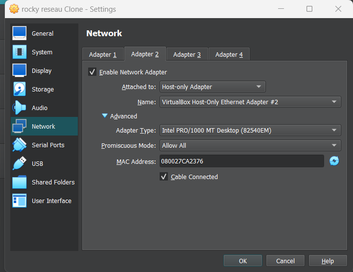
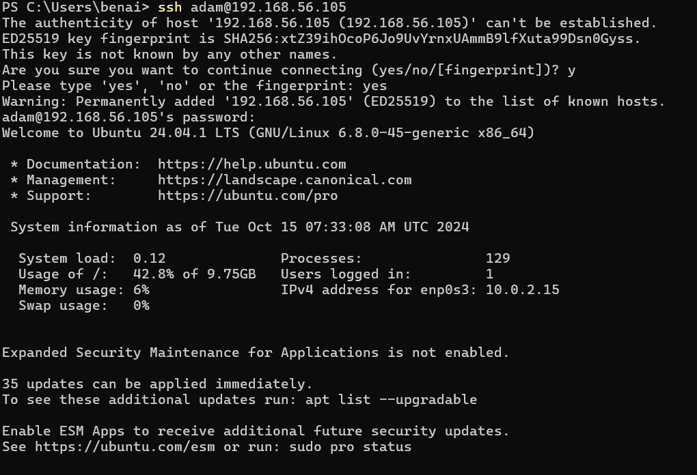
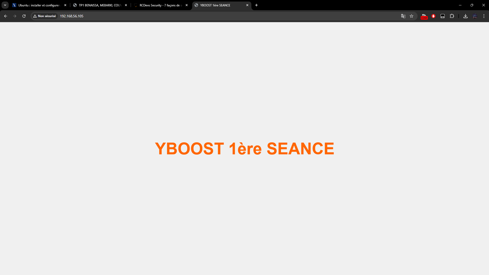
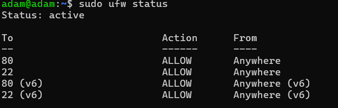

### Mettre en place une 2eme carte réseau et faire en sorte que ssh fonctionne

Pour mettre en place une deuxieme carte réseau je suis aller dans les paramètres de ma VM, j'ai activé une deuxieme carte réseau en 'Host-Only' et j'ai 'Allow All' pour pouvoir ping ma VM depuis mon ordinateur.

ensuite j'ai installé SSH sur ma VM avec les commandes:
sudo apt install openssh-client
sudo apt install openssh-server
Puis, je me suis connecté en ssh depuis mon powershell.

### Créer un serveur web

Pour mettre en place mon serveur j'ai lancé apache2, je suis aller jusqu'au fichier html, j'ai supprimé lancien index, j'ai touch un nouvel index et j'ai mis dedans le contenu du notion avec la commande sudo nano.

### Autoriser les ports 80 et 22

Pour les autoriser j'ai utiliser les commandes sudo ufw allow 80 et  "" 22. Puis j'ai lancer mon parefeu avec sudo ufw enable.

### Sécuriser SSH

