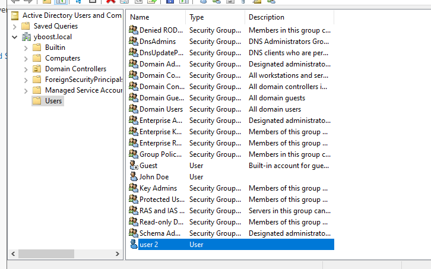
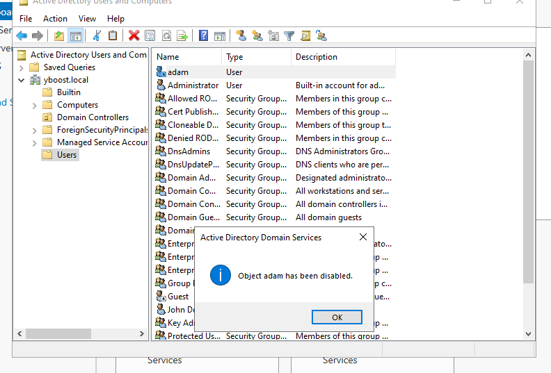
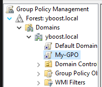
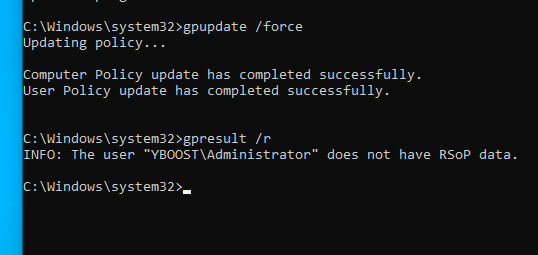
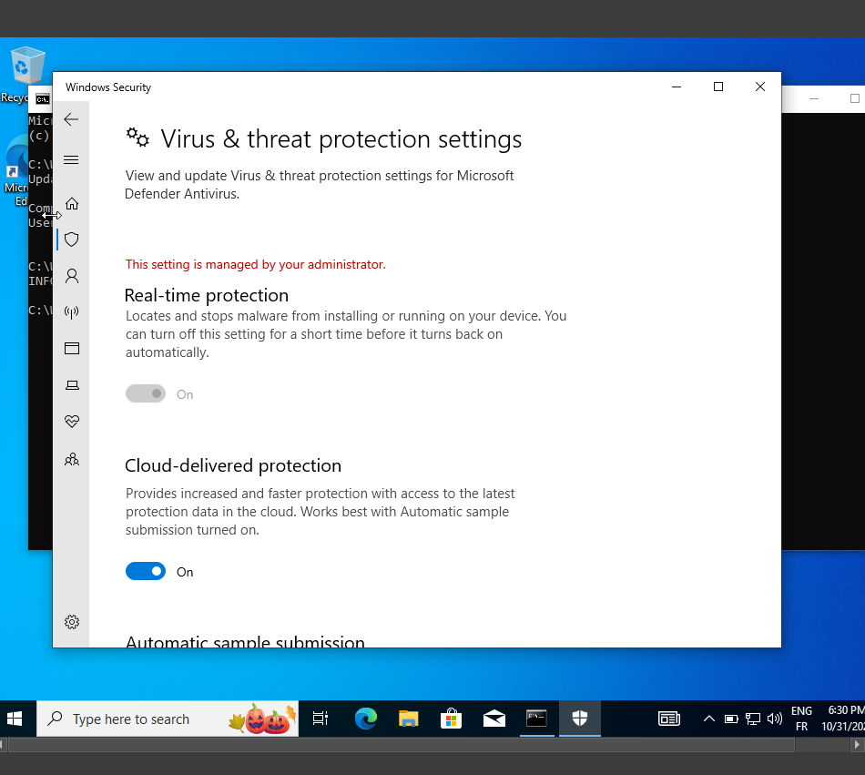

# Partie 1 : Setup
## Créer un nouvel utilisateur dans le domaine, je veux que vous me détailler comment vous avez fait.
 
```
Pour créer un deuxieme utilisateur, je suis aller dans "Active Directory Users and Computers", je suis aller dans mon domaine yboost.local puis dans "Users" j'ai créer un nouvel Utilisateur
```


 
```
Une fois mon deuxième Utilisateur créer, on peut voir qu'il apparait dans ma liste d'utilisateurs de mon domaine.
```


## Donnez moi aussi une commande powershell pour créer un 2eme utilisateur
```
On peut utiliser la commande suivante:
New-ADUser -Name "User 3" `
           -DisplayName "User 3" `
           -GivenName "User" `
           -Surname "3" `
           -SamAccountName "User3" `
           -UserPrincipalName "User3@yboost.local" `
           -EmailAddress "User3@yboost.local" `
           -Path "OU=Personnel,DC=IT-CONNECT,DC=LOCAL" `
           -AccountPassword(Read-Host -AsSecureString "Coucou1234") `
           -Enabled $true


 qui nous permet de créer un User 3 depuis powershell et de le parametrer comme bon nous semble.
```


## Joignez le PC au domaine
 
```

```


## Désactiver le compte par défaut que vous avez créer lors du setup du PC
 
```
Pour desactiver le User adam, je suis retouné dans mon "Active Directory Users and Computers" j'ai selectioner adam et disable account.

J'aurais aussi pus utiliser la commande depuis mon powershell:
Disable-ADAccount -Identity "adam"
```


## Faites moi le rendu de la GPO

```
J'ai commencé par créer ma GPO dans ma GMPC (Group Policy Managment Console), puis je l'ai configuré dans "Windows Defender Antivirus" de sorte à ce que Windows Defender ne puisse être desactiver par un Utilisateur de mon domaine.

J'ai commencé par desactiver les fonctions qui permetent de desactiver Windows Defender, puis j'ai autorisé windows defender à être actif en permanence.
```



```
Une fois ma GPO configurée, je l'ai activé sur mon PC User avec la commande  "gpupdate /force" executée en tant qu'admin. Pour vérifier que la GPO etait bien appliquée j'ai executé "gpresult /r"
```


```
Enfin, je suis aller voir si je pouvais desactiver Defender depuis mon PC User et en effet, je ne pouvais plus.
```